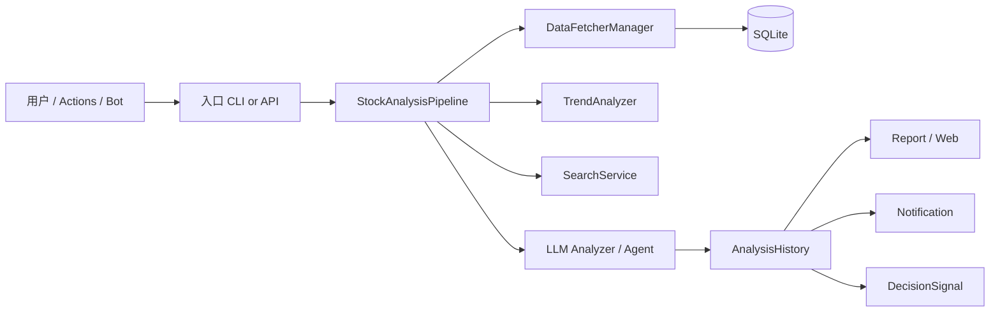

# 技术架构方案

本文整理当前仓库的**技术架构方案**：系统定位、分层结构、主链路、关键子系统边界与部署形态。

实现细节若与本文冲突，以代码为准。单股分析流程见 [stock-analysis.md](stock-analysis.md)；数据源接口见 [data-fetch-interfaces.md](data-fetch-interfaces.md)。

---

## 1. 系统定位

**Daily Stock Analysis（DSA）** 是一套股票智能分析系统，覆盖 A 股、港股、美股及日/韩/台等扩展市场。

主价值链：

```text
抓取行情与情报 → 技术分析 / 上下文增强 → LLM 结构化分析 → 报告落库 → 多渠道通知
```

面向三类使用方式：

| 形态 | 入口 | 典型场景 |
| --- | --- | --- |
| CLI / 定时任务 | `main.py` | 本地批量分析、GitHub Actions 每日任务、`--schedule` |
| Web / Desktop | `server.py` + `apps/dsa-web` / `apps/dsa-desktop` | 工作台、配置、历史报告、Agent 问股 |
| Bot / IM | `bot/` | 飞书 / 钉钉 / Discord 等命令与流式对话 |

---

## 2. 设计原则

| 原则 | 含义 |
| --- | --- |
| 稳定性优先 | 单股、单数据源、单通知渠道失败默认不拖垮整批任务 |
| 可降级（fail-open） | 实时行情、筹码、基本面、新闻等增强项缺失时继续分析，并标记质量状态 |
| 多源 fallback | `DataFetcherManager` 按优先级 / 市场路由切换；熔断短期跳过坏源 |
| 配置增强而非互斥 | 不配 Token 可零配置跑免费源；配 Token 后增强稳定性与能力 |
| 契约兼容 | API / Schema 优先追加字段；Web / Desktop / Bot 共用后端契约 |
| 目录边界清晰 | 后端 `src/` + `data_provider/` + `api/` + `bot/`；前端 `apps/dsa-web`；桌面 `apps/dsa-desktop` |

---

## 3. 技术栈一览

| 层级 | 技术 |
| --- | --- |
| 语言 / 运行时 | Python 3.10+ |
| Web API | FastAPI + Uvicorn |
| ORM / 存储 | SQLAlchemy 2.x + SQLite（默认 `./data/stock_analysis.db`） |
| 数据处理 | pandas / numpy |
| LLM | LiteLLM 统一路由（Gemini / OpenAI 兼容 / Anthropic / DeepSeek / Ollama 等） |
| 行情源 | TickFlow、Tushare、AkShare、Efinance、Pytdx、Baostock、YFinance、Longbridge 等 |
| 新闻搜索 | Anspire、SerpAPI、Tavily、Bocha、Brave、MiniMax、SearXNG 等 |
| 前端 | React + TypeScript（Vite），`apps/dsa-web` |
| 桌面端 | Electron，`apps/dsa-desktop`（内嵌 Web 构建产物） |
| 部署 | Docker / docker-compose、GitHub Actions、systemd 等 |
| 选股引擎 | 内置 AlphaSift（可选） |
| 策略技能 | `strategies/*.yaml` + Agent Skill 运行时 |

---

## 4. 逻辑架构

```text
┌──────────────────────────────────────────────────────────────────────────┐
│ 接入层                                                                    │
│  CLI (main.py) │ Web (dsa-web) │ Desktop (Electron) │ Bot (IM) │ Actions  │
└────────────┬───────────────┬───────────────┬───────────────┬─────────────┘
             │               │               │               │
             ▼               ▼               ▼               ▼
┌──────────────────────────────────────────────────────────────────────────┐
│ API / 编排入口                                                            │
│  FastAPI (server.py → api/app.py → /api/v1/*)                             │
│  认证中间件 · 任务队列 · SSE/流式事件                                       │
└────────────────────────────────┬─────────────────────────────────────────┘
                                 │
┌────────────────────────────────▼─────────────────────────────────────────┐
│ 业务服务层 (src/services/)                                                │
│  analysis / task / portfolio / alerts / decision_signal / intelligence    │
│  system_config / backtest / report_renderer / image_stock_extractor …     │
└────────────┬───────────────────────────────┬─────────────────────────────┘
             │                               │
┌────────────▼──────────────┐   ┌────────────▼─────────────────────────────┐
│ 核心编排 (src/core/)       │   │ Agent 子系统 (src/agent/)                 │
│  StockAnalysisPipeline     │   │  Orchestrator · Executor · Skills/Tools  │
│  market_review · backtest  │   │  策略 YAML · 多轮对话 · 流式输出           │
│  trading_calendar · config │   └────────────┬────────────────────────────┘
└────────────┬──────────────┘                │
             │                               │
┌────────────▼───────────────────────────────▼─────────────────────────────┐
│ 分析与智能                                                                │
│  GeminiAnalyzer (src/analyzer.py) · StockTrendAnalyzer · SearchService   │
│  LLM Backend (src/llm/) · AnalysisContextPack · 阶段/结构护栏              │
└────────────┬───────────────────────────────┬─────────────────────────────┘
             │                               │
┌────────────▼──────────────┐   ┌────────────▼─────────────────────────────┐
│ 数据提供层                 │   │ 持久化 / 仓储                              │
│  data_provider/            │   │  storage.py (ORM) · repositories/         │
│  DataFetcherManager        │   │  SQLite · reports/ · logs/                │
│  Fetcher 策略 + fallback   │   └──────────────────────────────────────────┘
└───────────────────────────┘
             │
┌────────────▼─────────────────────────────────────────────────────────────┐
│ 出口层                                                                    │
│  NotificationService · Markdown/图片报告 · Web 历史页 · Bot 回复           │
└──────────────────────────────────────────────────────────────────────────┘
```

### 4.1 分层职责

| 层 | 目录 / 入口 | 职责 |
| --- | --- | --- |
| 接入 | `main.py`、`apps/*`、`bot/`、`.github/workflows/` | 触发分析、展示 UI、接收 IM 命令、CI 定时 |
| API | `api/`、`server.py` | REST、认证、静态资源托管、任务流 |
| 服务 | `src/services/` | 业务用例编排，对 API / Pipeline 提供可复用能力 |
| 核心 | `src/core/` | 单股流水线、大盘复盘、回测、交易日历、配置注册表 |
| Agent | `src/agent/`、`strategies/` | 技能策略、工具调用、对话与编排 |
| 分析 | `src/analyzer.py`、`src/stock_analyzer.py`、`src/search_service.py` | Prompt、趋势指标、情报聚合、护栏 |
| LLM | `src/llm/` | Generation Backend 抽象、LiteLLM / 本地 CLI 等 |
| 数据 | `data_provider/` | 多市场行情 Fetcher、标准化列、熔断与 fallback |
| 仓储 | `src/storage.py`、`src/repositories/`、`src/schemas/` | ORM、仓储访问、契约 Schema |
| 通知 | `src/notification.py`、`src/notification_sender/` | 渠道检测、模板渲染、分发结果 |

---

## 5. 目录边界（与仓库约定一致）

```text
daily_stock_analysis/
├── main.py                 # CLI / 调度 / 分析主入口
├── server.py               # FastAPI uvicorn 入口
├── api/                    # FastAPI 应用、中间件、v1 endpoints
├── bot/                    # IM Bot 平台与命令
├── data_provider/          # 行情 Fetcher 与 DataFetcherManager
├── src/
│   ├── core/               # Pipeline、大盘复盘、回测、配置
│   ├── services/           # 业务服务
│   ├── agent/              # Agent 编排、技能、工具
│   ├── llm/                # LLM Backend
│   ├── repositories/       # 数据访问
│   ├── schemas/            # 结构化契约
│   ├── notification*.py    # 通知
│   ├── analyzer.py         # LLM 分析器（决策仪表盘）
│   ├── storage.py          # SQLAlchemy ORM + DatabaseManager
│   └── config.py           # 环境配置聚合
├── strategies/             # Agent 策略 YAML（均线/缠论/波浪等）
├── apps/
│   ├── dsa-web/            # Web 前端
│   └── dsa-desktop/        # Electron 桌面端
├── docker/                 # Dockerfile / compose
├── scripts/                # 本地脚本、CI gate
├── tests/                  # pytest
└── docs/                   # 文档；本文件在 docs/wiki/
```

---

## 6. 核心链路

### 6.1 单股分析（主路径）

编排类：`src/core/pipeline.py` → `StockAnalysisPipeline`。

```text
触发（CLI / API / 定时 / Bot）
  → StockAnalysisPipeline.run(stock_codes)
    → process_single_stock(code)
      → fetch_and_save_stock_data()     # 日线 → SQLite
      → analyze_stock()
          → 市场阶段 / 日级大盘上下文（可选）
          → 实时 / 筹码 / 基本面 / 市场结构
          → StockTrendAnalyzer（MA / 乖离 / 量能 / MACD / RSI）
          → 分支：
              · AGENT_MODE / skills → Agent 链路
              · 默认 → SearchService 情报 → GeminiAnalyzer
          → 阶段/结构护栏 + save_analysis_history
          → DecisionSignal 提取（可选）
          → 通知（批量或单股）
```

常用命令：

```bash
python main.py
python main.py --stocks 600519,hk00700,AAPL
python main.py --dry-run
python main.py --market-review
python main.py --schedule
python main.py --serve-only
```

### 6.2 大盘复盘

编排：`src/core/market_review.py`（`run_market_review`），配合交易日历、市场宽度、板块排名与 LLM 摘要。指数与宽度优先 TickFlow（若配置），失败回退免费源。

### 6.3 Agent 策略问股

```text
Web Chat / Bot / API /api/v1/agent/*
  → build_agent_executor()          # src/agent/factory.py
  → AgentExecutor / Orchestrator
      → SkillManager（strategies/*.yaml）
      → ToolRegistry（行情、搜索等工具）
      → LLM Backend
  → 流式事件（SSE）→ 前端 / Bot
```

默认批量分析走「情报 + Analyzer」；开启 Agent 模式或显式技能时，Pipeline 可走 `_analyze_with_agent`。

### 6.4 API 任务分析

```text
POST /api/v1/analysis/analyze
  → TaskService / 任务队列
  → 后台执行 Pipeline
  → GET/SSE tasks、flow 诊断
  → History / DecisionSignals 可读
```

---

## 7. 数据架构

### 7.1 DataFetcherManager

- 模式：策略模式。`BaseFetcher` 定义统一接口，`DataFetcherManager` 按 `priority` 与市场过滤调度。
- 日线列标准化：`date/open/high/low/close/volume/amount/pct_chg`。
- 能力：日线、实时、筹码、基本面上下文、指数、市场统计、板块排名等。
- 失败：切换下一源 + 诊断记录；连续失败短期熔断。

详细矩阵与底层 API 见 [data-fetch-interfaces.md](data-fetch-interfaces.md)、[data-source-stability.md](../data-source-stability.md)。

### 7.2 持久化模型（摘要）

默认 SQLite，由 `DatabaseManager` 管理连接与迁移版本。

| 概念 | 用途 |
| --- | --- |
| `StockDaily` | 日线 OHLCV 缓存，支持断点续传 |
| `AnalysisHistory` | 分析历史、报告 Markdown、诊断快照 |
| Portfolio / Alerts / DecisionSignal 等 | 持仓、告警规则、决策信号与后验 |
| Intelligence items | 资讯源条目去重存储 |

业务访问优先通过 `src/repositories/`，避免 API 层直接拼 SQL。

### 7.3 报告产物

- 库内历史记录（Web 可查完整 Markdown）
- 可选本地 `reports/` 文件
- 通知渠道卡片 / 图片（`md2img` 等）

---

## 8. LLM 与配置架构

```text
.env / Web 系统设置 / 导入导出
  → src/config.py（Config 聚合）
  → src/core/config_registry.py（字段元数据 / Schema）
  → src/llm/backend_factory.py
      → LiteLLMBackend / Local CLI / Hermes 等
  → Analyzer / Agent Executor 消费
```

要点：

- 支持渠道模式（`LLM_CHANNELS`）与传统单 Key 模式并存。
- Agent 与批量分析可使用不同模型路由；`AGENT_MODE` 表达意图，但须满足安全可部署路由。
- 配置变更经 `ConfigManager` 写回 `.env`，Web 设置页走 `/api/v1/system/config*`。

详见 [LLM_CONFIG_GUIDE.md](../LLM_CONFIG_GUIDE.md)、[llm-providers.md](../llm-providers.md)。

---

## 9. API / 前端 / 桌面 / Bot

### 9.1 FastAPI 路由（`/api/v1`）

| 前缀 | 能力 |
| --- | --- |
| `/auth` | 登录会话（可选启用） |
| `/analysis` | 触发分析、任务状态、流式进度 |
| `/history` | 历史报告与 flow |
| `/agent` | 策略问股、会话 |
| `/stocks` | 股票列表 / 补全 |
| `/portfolio` | 持仓与风险 |
| `/alerts` | 实时告警规则与触发 |
| `/decision-signals` | 决策信号池与后验 |
| `/alphasift` | 选股引擎 |
| `/intelligence` | 资讯源 |
| `/system` | 配置 Schema / 导入导出 |
| `/usage` | Token 用量 |
| `/backtest` | 回测 |
| `/health` | 健康检查 |

认证：`api/middlewares/auth.py` 在启用管理员认证时保护 `/api/v1/*`（登录/状态接口豁免）。

OpenAPI 产物：`docs/architecture/api_spec.json`。

### 9.2 Web（`apps/dsa-web`）

主要页面：工作台、对话、持仓、回测、决策信号、告警、选股、设置、用量等。  
生产模式由 FastAPI 托管前端静态资源（`src/webui_frontend.py` 准备构建产物）。

### 9.3 Desktop（`apps/dsa-desktop`）

Electron 壳 + 内嵌后端 / Web 构建；打包与发布见 [desktop-package.md](../desktop-package.md)。

### 9.4 Bot（`bot/`）

平台适配（飞书 Stream、钉钉、Discord 等）+ 命令层（分析、问股、聊天），复用 `build_agent_executor` 与分析服务，避免平行实现。

---

## 10. 通知与告警

```text
AnalysisResult / Alert 事件
  → NotificationService
      → ChannelDetector（企业微信 / 飞书 / Telegram / Discord / Slack / 邮件 …）
      → 模板渲染 / 可选 Markdown→图片
      → 分发；单渠道失败记结果，默认不 fail-fast 整批
```

告警中心（EventMonitor）与 DecisionSignal 可联动规则触发。详见 [notifications.md](../notifications.md)、[alerts.md](../alerts.md)、[decision-signals.md](../decision-signals.md)。

---

## 11. 部署与流水线

### 11.1 运行形态

| 形态 | 说明 |
| --- | --- |
| 本地 CLI | `python main.py` |
| 本地 API | `uvicorn server:app` 或 `python main.py --serve-only` |
| Docker | `docker/docker-compose.yml`，挂载 `data/` `logs/` `reports/` |
| GitHub Actions | `.github/workflows/00-daily-analysis.yml` 等，Secrets 注入配置 |
| Desktop 安装包 | `desktop-release` 工作流 |

### 11.2 CI 护栏（摘要）

| 检查 | 作用 |
| --- | --- |
| `ai-governance` | AGENTS.md / 指令资产一致性 |
| `backend-gate` | `./scripts/ci_gate.sh` |
| `docker-build` | 镜像构建与导入 smoke |
| `web-gate` | 前端 lint + build（有前端改动时） |
| `network-smoke` | 在线观测，非硬阻断 |

---

## 12. 关键数据流（端到端）



---

## 13. 扩展点（按现有边界）

| 想扩展 | 建议落点 | 注意 |
| --- | --- | --- |
| 新行情源 | `data_provider/*_fetcher.py` + Manager 注册 | 实现标准列、市场 support、priority、熔断 |
| 新通知渠道 | `notification_sender/` + Channel 枚举 | 失败隔离；更新 notifications 文档 |
| 新 Agent 策略 | `strategies/*.yaml` | 与 SkillManager / 多策略契约对齐 |
| 新 API | `api/v1/endpoints/` + router 挂载 | Schema 兼容；必要时更新 api_spec |
| 新 Web 页 | `apps/dsa-web/src/pages/` | 复用现有 API client / stores |
| 新配置项 | `config.py` + `config_registry` + `.env.example` | 同步文档与 CHANGELOG |

---

## 14. 相关文档

| 文档 | 内容 |
| --- | --- |
| [stock-analysis.md](stock-analysis.md) | 单股分析需要什么、端到端步骤 |
| [data-fetch-interfaces.md](data-fetch-interfaces.md) | Manager / Fetcher / 底层 API 速查 |
| [data-source-stability.md](../data-source-stability.md) | 用户向降级与推荐配置 |
| [analysis-context-pack.md](../analysis-context-pack.md) | 分析上下文包契约 |
| [multi-strategy-contract.md](../multi-strategy-contract.md) | 多策略契约 |
| [agent-stream-events.md](../agent-stream-events.md) | Agent 流式事件 |
| [full-guide.md](../full-guide.md) | 完整配置与部署 |
| [DEPLOY.md](../DEPLOY.md) | 服务器部署 |
| [AGENTS.md](../../AGENTS.md) | 仓库协作与目录边界真源 |

---

## 15. 文档元信息

| 项 | 值 |
| --- | --- |
| 文档类型 | Explanation + Reference（架构总览） |
| 基线 | 以当前 `dev` 工作区代码结构为准 |
| 未覆盖 | 逐字段 API Schema、逐配置项默认值（见 OpenAPI 与 LLM/配置专题） |
| 英文版 | 未同步；需要时再补 `technical-architecture_EN.md` |
